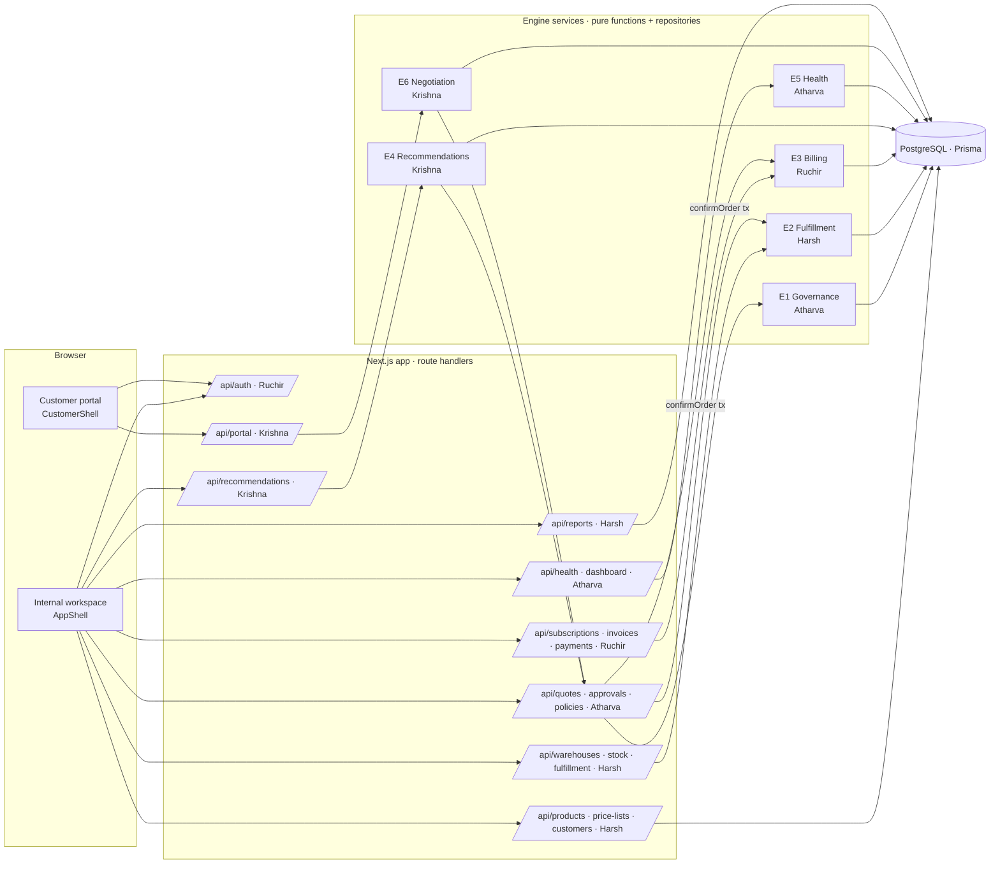
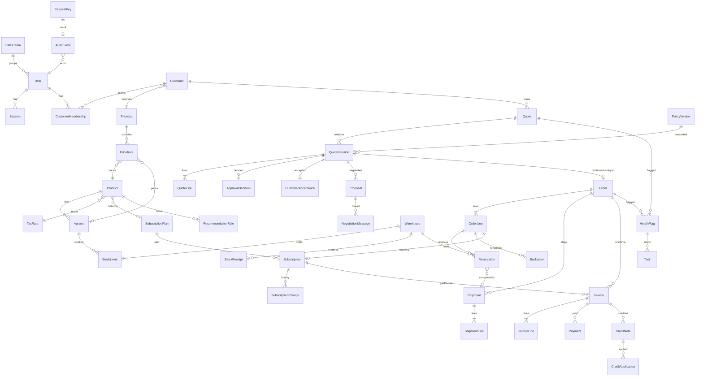

# DealFlow360 — One-Page Architecture & Data Model

_Owner: Harsh (blueprint §4, §14). Other owners verify their portions. Draft — updated as lanes land._

## Runtime shape

One Next.js (App Router) application: React screens + server route handlers, TypeScript
throughout, Tailwind UI kit (Krishna). One PostgreSQL database via Prisma (Ruchir). Six
server-side engine services; no microservices or message broker. Session-cookie auth
(Ruchir) yields an `Actor {id, role, customerId?, active}` for every request.



## Confirmation handoff (the one cross-engine transaction)

`confirmOrder` (Atharva) validates approval + customer acceptance on the **same revision**,
creates one immutable `Order` (unique source revision), and in the same transaction calls
`initializeFulfillment(tx, order)` (Harsh — records PENDING, reserves nothing) and
`initializeBilling(tx, order, requestKey)` (Ruchir — one-time invoice + subscription
records). Stock is reserved only when allocation is **accepted** later.

## Data model (minimum, blueprint §10)



Key constraints: one order per accepted revision; unique invoice per (subscription,
period, type); unique replay keys (receipt, accept, payment); `onHand ≥ reserved ≥ 0`;
payments/credits never applied twice; customer FK + membership check on every portal read;
products archived, never deleted.

## Harsh's lane internals

```
src/contracts/harsh.ts        types shared with other lanes (catalog, inventory, reports)
src/fixtures/harsh.ts         §13 demo numbers (DEV FIXTURE)
src/features/catalog/         engine/resolve-price · repository · service · api (zod)
src/features/inventory/       engine/{demand,availability,split,validate-plan,status} · repository · service
src/features/reports/         engine/{period,filter,aggregate,export-xlsx,export-pdf} · repository · service
src/app/api/{customers,products,price-lists,catalog,warehouses,stock,fulfillment,reports}
src/app/(internal)/{products,customers,warehouses,fulfillment,reports}
```

Engine functions are pure (inputs → outputs, no DB import). Services add role checks,
request-key idempotency, transactions and audit. Repositories are interfaces with an
in-memory fixture implementation now and a Prisma implementation once the schema lands.

## Roadmap note (what we would build next)

Live payment gateway; e-mail/Slack nudges; courier rate lookup for real shipping costs;
learned co-purchase weights for recommendations; SSO; multi-company and currency
conversion; scheduled (cron) due-billing and health refresh instead of manual buttons.
